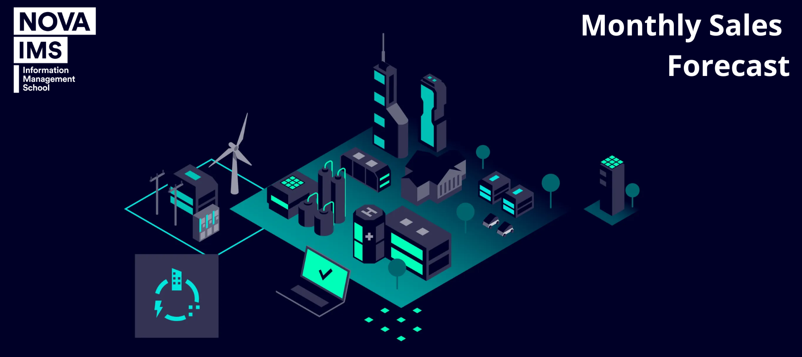

  

<h3 align="center">📍 University: Nova IMS</h3>

---

<h3 align="center">📌 Group P</h3>

| **Student Name**     | **Student ID**  |  
|----------------------|---------------|  
| Beatriz Monteiro     | 20240591       |  
| Catarina Nunes       | 20230083       |  
| Margarida Raposo     | 20241020       |  
| Teresa Menezes       | 20240333       |  

Our goal is to conduct sales forecasting monthly for 10 months, from May 2022 until February 2023, 
selecting product groups from one business unit of the Smart Infrastructure division, with a specific 
focus on Germany, the largest country for this business unit.   

By examining internal sales data, production levels, and shipments in addition to including external 
variables like market prices, economic indicators, and industry trends, our goal is to create an accurate 
model that can predict future sales. This analysis will help in determining the key variables that affect 
sales success in addition to providing useful information for strategic decision-making.  
